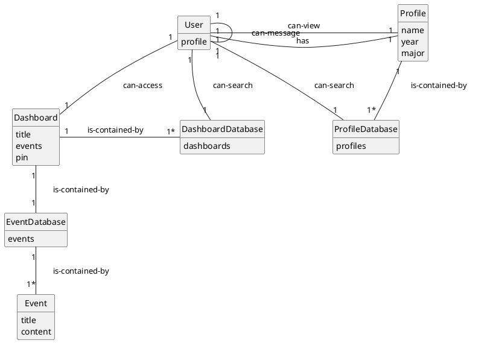
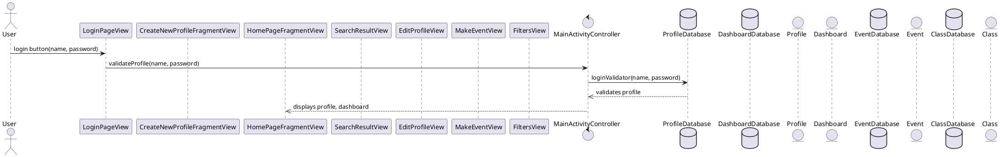
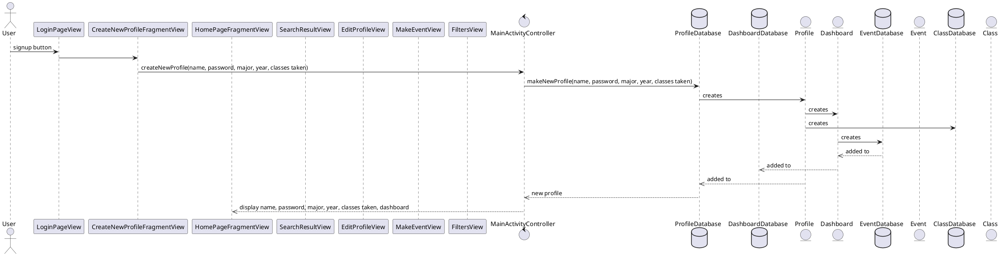
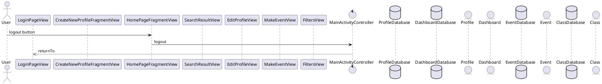
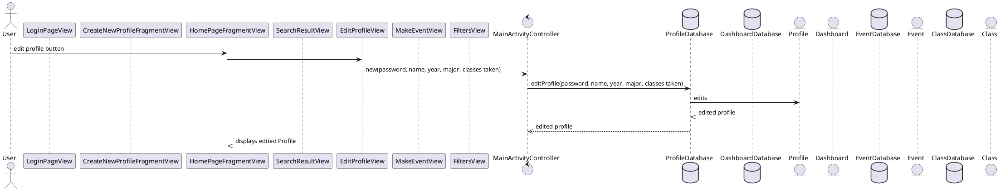
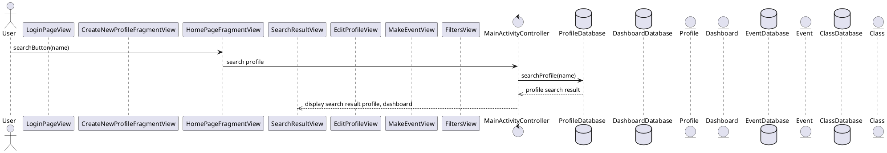
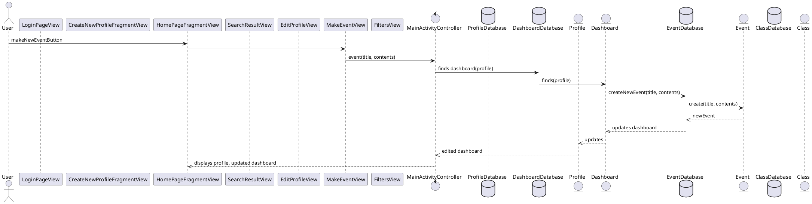
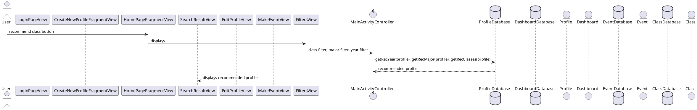
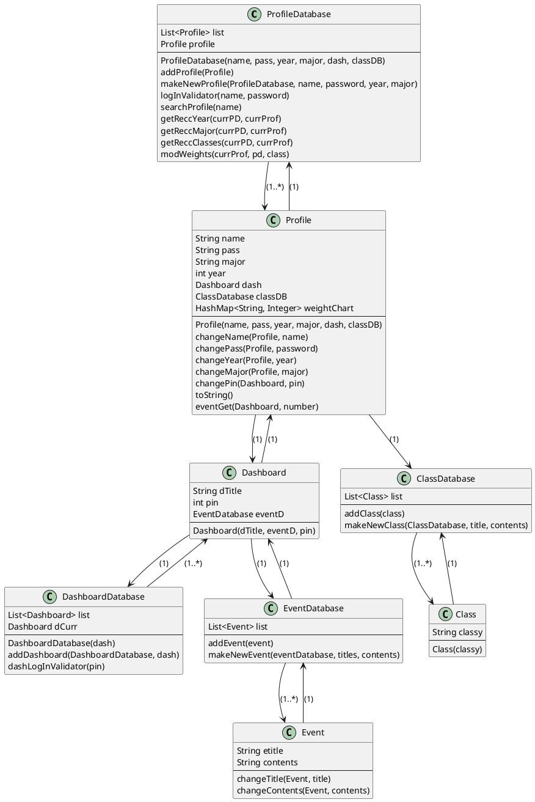

```plantuml
@startuml 
hide circle 
hide empty methods 

''Domain Model

'classes 
class User { 
profile
} 

class Profile { 
name
year 
major
} 

class Dashboard { 
title 
events 
pin  
} 

class ProfileDatabase { 
profiles 
} 

class DashboardDatabase { 
dashboards 
} 

class Event { 
title 
content 
} 

class EventDatabase { 
events 
} 

'associations 
User "1" - "1" Profile : \thas\t\t 
User "1" - "1" Profile : \tcan-view\t\t 
User "1" - "1" User : \tcan-message\t\t 
User "1" -- "1" Dashboard : \tcan-access\t\t 
User "1" - "1" ProfileDatabase : \tcan-search\t\t 
User "1" -- "1" DashboardDatabase : \tcan-search\t\t 
Profile "1" -- "1*" ProfileDatabase : \tis-contained-by\t\t 
Dashboard "1" - "1*" DashboardDatabase : \tis-contained-by\t\t 
Dashboard "1" -- "1" EventDatabase : \tis-contained-by\t\t 
EventDatabase "1" -- "1*" Event : \tis-contained-by\t\t 
@enduml 
```

```plantuml
@startuml

'Sequence Diagram Use Case 1
'MVC/Java Classes

actor User   
participant LoginPageView
participant CreateNewProfileFragmentView
participant HomePageFragmentView
participant SearchResultView
participant EditProfileView
participant MakeEventView
participant FiltersView


control MainActivityController
database ProfileDatabase
database DashboardDatabase
entity Profile
entity Dashboard
database EventDatabase
entity Event
database ClassDatabase
entity Class

User->LoginPageView: login button(name, password)
LoginPageView->MainActivityController: validateProfile(name, password)
MainActivityController->ProfileDatabase: loginValidator(name, password)
ProfileDatabase-->>MainActivityController:validates profile
MainActivityController-->>HomePageFragmentView: displays profile, dashboard

@enduml
```

```plantuml
@startuml

'Sequence Diagram Use Case 2
'MVC/Java Classes

actor User   
participant LoginPageView
participant CreateNewProfileFragmentView
participant HomePageFragmentView
participant SearchResultView
participant EditProfileView
participant MakeEventView
participant FiltersView


control MainActivityController
database ProfileDatabase
database DashboardDatabase
entity Profile
entity Dashboard
database EventDatabase
entity Event
database ClassDatabase
entity Class

'connections
User->LoginPageView: signup button
LoginPageView->CreateNewProfileFragmentView:
CreateNewProfileFragmentView->MainActivityController: createNewProfile(name, password, major, year, classes taken)
MainActivityController->ProfileDatabase: makeNewProfile(name, password, major, year, classes taken)
ProfileDatabase->Profile: creates
Profile->Dashboard: creates
Profile->ClassDatabase: creates
Dashboard->EventDatabase: creates
EventDatabase-->>Dashboard: added to
Dashboard-->>DashboardDatabase: added to
Profile-->>ProfileDatabase: added to
ProfileDatabase-->>MainActivityController: new profile
MainActivityController-->>HomePageFragmentView: display name, password, major, year, classes taken, dashboard

@enduml
```

```plantuml
@startuml

'Sequence Diagram Use Case 3
'MVC/Java Classes

actor User   
participant LoginPageView
participant CreateNewProfileFragmentView
participant HomePageFragmentView
participant SearchResultView
participant EditProfileView
participant MakeEventView
participant FiltersView


control MainActivityController
database ProfileDatabase
database DashboardDatabase
entity Profile
entity Dashboard
database EventDatabase
entity Event
database ClassDatabase
entity Class

User->HomePageFragmentView: logout button
HomePageFragmentView->MainActivityController: logout
MainActivityController-->>LoginPageView: returnTo

@enduml
```

```plantuml
@startuml

'Sequence Diagram Use Case 4
'MVC/Java Classes

actor User   
participant LoginPageView
participant CreateNewProfileFragmentView
participant HomePageFragmentView
participant SearchResultView
participant EditProfileView
participant MakeEventView
participant FiltersView


control MainActivityController
database ProfileDatabase
database DashboardDatabase
entity Profile
entity Dashboard
database EventDatabase
entity Event
database ClassDatabase
entity Class

User->HomePageFragmentView: edit profile button
HomePageFragmentView-> EditProfileView
EditProfileView->MainActivityController: new(password, name, year, major, classes taken)
MainActivityController->ProfileDatabase: editProfile(password, name, year, major, classes taken)
ProfileDatabase->Profile:edits
Profile-->>ProfileDatabase:edited profile
ProfileDatabase-->>MainActivityController:edited profile
MainActivityController-->>HomePageFragmentView: displays edited Profile

@enduml
```

```plantuml
@startuml

'Sequence Diagram Use Case 5
'MVC/Java Classes

actor User   
participant LoginPageView
participant CreateNewProfileFragmentView
participant HomePageFragmentView
participant SearchResultView
participant EditProfileView
participant MakeEventView
participant FiltersView


control MainActivityController
database ProfileDatabase
database DashboardDatabase
entity Profile
entity Dashboard
database EventDatabase
entity Event
database ClassDatabase
entity Class

User->HomePageFragmentView:searchButton(name)
HomePageFragmentView->MainActivityController: search profile
MainActivityController->ProfileDatabase: searchProfile(name)
ProfileDatabase-->>MainActivityController: profile search result
MainActivityController-->>SearchResultView:display search result profile, dashboard

@enduml
```

```plantuml
@startuml

'Sequence Diagram Use Case 6
'MVC/Java Classes

actor User   
participant LoginPageView
participant CreateNewProfileFragmentView
participant HomePageFragmentView
participant SearchResultView
participant EditProfileView
participant MakeEventView
participant FiltersView


control MainActivityController
database ProfileDatabase
database DashboardDatabase
entity Profile
entity Dashboard
database EventDatabase
entity Event
database ClassDatabase
entity Class

User->HomePageFragmentView:makeNewEventButton
HomePageFragmentView->MakeEventView
MakeEventView->MainActivityController:event(title, contents)
MainActivityController->DashboardDatabase:finds dashboard(profile)
DashboardDatabase->Dashboard:finds(profile)
Dashboard->EventDatabase:createNewEvent(title, contents)
EventDatabase->Event:create(title, contents)
Event-->>EventDatabase:newEvent
EventDatabase-->>Dashboard: updates dashboard
Dashboard-->>Profile: updates
Profile-->>MainActivityController:edited dashboard
MainActivityController-->>HomePageFragmentView:displays profile, updated dashboard

@enduml
```

```plantuml
@startuml

'Sequence Diagram Use Case 7
'MVC/Java Classes

actor User   
participant LoginPageView
participant CreateNewProfileFragmentView
participant HomePageFragmentView
participant SearchResultView
participant EditProfileView
participant MakeEventView
participant FiltersView


control MainActivityController
database ProfileDatabase
database DashboardDatabase
entity Profile
entity Dashboard
database EventDatabase
entity Event
database ClassDatabase
entity Class

User->HomePageFragmentView: recommend class button
HomePageFragmentView->FiltersView: displays
FiltersView->MainActivityController: class filter, major filter, year filter
MainActivityController->ProfileDatabase:getRecYear(profile), getRecMajor(profile), getRecClasses(profile)
ProfileDatabase-->MainActivityController: recommended profile
MainActivityController-->SearchResultView: displays recommended profile

@enduml
```

```plantuml
@startuml
hide empty methods

'Class Diagram
'classes

class ProfileDatabase {
List<Profile> list
Profile profile
--
ProfileDatabase(name, pass, year, major, dash, classDB)
addProfile(Profile)
makeNewProfile(ProfileDatabase, name, password, year, major)
logInValidator(name, password)
searchProfile(name)
getReccYear(currPD, currProf)
getReccMajor(currPD, currProf)
getReccClasses(currPD, currProf)
modWeights(currProf, pd, class)
}

class Profile {
String name
String pass
String major
int year
Dashboard dash
ClassDatabase classDB
HashMap<String, Integer> weightChart
--
Profile(name, pass, year, major, dash, classDB)
changeName(Profile, name)
changePass(Profile, password)
changeYear(Profile, year)
changeMajor(Profile, major)
changePin(Dashboard, pin)
toString()
eventGet(Dashboard, number)
}

class DashboardDatabase {
List<Dashboard> list
Dashboard dCurr
--
DashboardDatabase(dash)
addDashboard(DashboardDatabase, dash)
dashLogInValidator(pin)
}

class Dashboard {
String dTitle
int pin
EventDatabase eventD
--
Dashboard(dTitle, eventD, pin)
}

class EventDatabase {
List<Event> list
--
addEvent(event)
makeNewEvent(eventDatabase, titles, contents)
}

class Event {
String etitle
String contents
--
changeTitle(Event, title)
changeContents(Event, contents)
}

class ClassDatabase {
List<Class> list
--
addClass(class)
makeNewClass(ClassDatabase, title, contents)
}

class Class{
String classy
--
Class(classy)
}

'connections
ProfileDatabase --> Profile: (1..*)
Profile -->ProfileDatabase: (1)
Profile --> Dashboard: (1)
Dashboard --> Profile:(1)
Profile-->ClassDatabase: (1)
DashboardDatabase --> Dashboard: (1..*)
Dashboard --> DashboardDatabase: (1)
Dashboard --> EventDatabase: (1)
EventDatabase --> Dashboard: (1)
EventDatabase --> Event: (1..*)
Event --> EventDatabase: (1)
ClassDatabase--> Class: (1..*)
Class-->ClassDatabase:(1)

@enduml
```
